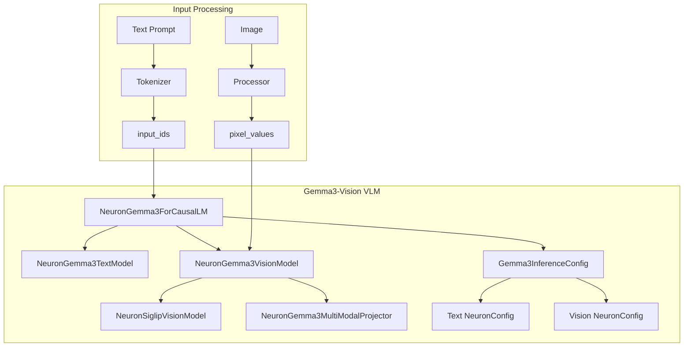
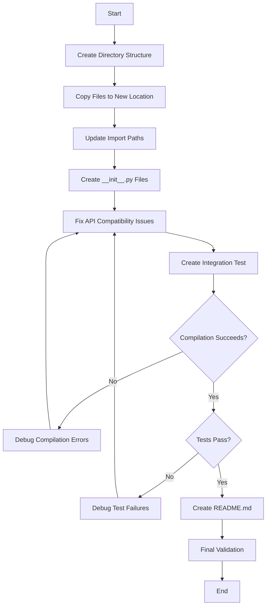

# Design Document: Gemma3-Vision Model Migration

## Overview

This design document describes the migration of the Gemma3-Vision VLM (Vision-Language Model) from `tmp/external-code/` to the proper contrib models structure at `contrib/models/gemma3-vision/`. The migration involves:

1. **File reorganization**: Moving model files to the standard contrib structure
2. **API compatibility**: Upgrading from NxDI v0.6.10598 (Neuron 2.26.1) to v0.7.14366 (Neuron 2.27.1)
3. **Integration testing**: Creating comprehensive tests for text+image and text-only generation
4. **Documentation**: Providing usage examples and compatibility information

**Key Architecture Characteristics:**
- **Dual Configuration**: Separate NeuronConfig instances for text model and vision encoder
- **Vision Encoder**: SigLIP-based encoder with average pooling and projection
- **No Custom KV Cache**: Uses standard KV cache (unlike Cohere2 reference)
- **Base Classes**: Extends `ImageToTextInferenceConfig` and `NeuronBaseForImageToText`

## Architecture

### High-Level Component Diagram



### Class Hierarchy

```
ImageToTextInferenceConfig (NxDI base)
    └── Gemma3InferenceConfig
        ├── text_neuron_config: NeuronConfig
        └── vision_neuron_config: NeuronConfig

NeuronBaseForImageToText (NxDI base)
    └── NeuronGemma3ForCausalLM
        ├── text_model_cls = NeuronGemma3TextModel
        ├── vision_model_cls = NeuronGemma3VisionModel
        ├── text_model_wrapper = ImageToTextModelWrapper
        └── vision_model_wrapper = Gemma3VisionModelWrapper

NeuronBaseModel (NxDI base)
    ├── NeuronGemma3TextModel
    │   ├── embed_tokens: ParallelEmbedding
    │   ├── layers: List[NeuronGemma3DecoderLayer]
    │   └── lm_head: ColumnParallelLinear
    └── NeuronGemma3VisionModel
        ├── vision_encoder: NeuronSiglipVisionModel
        └── multi_modal_projector: NeuronGemma3MultiModalProjector
```

### Dual Configuration Architecture

Gemma3-Vision requires two separate NeuronConfig instances with different optimization settings:

**Text Configuration** (for context encoding and token generation):
- `fused_qkv=True`: Fuses Q, K, V projections for efficiency
- `attn_kernel_enabled=True`: Enables attention kernels
- `enable_bucketing=True`: Supports dynamic sequence lengths
- `context_encoding_buckets` and `token_generation_buckets`: Separate bucket configurations

**Vision Configuration** (for SigLIP encoder):
- `fused_qkv=False`: SigLIP requires separate Q, K, V projections
- `attn_kernel_enabled=True`: Enables attention kernels
- `enable_bucketing=True`: Supports dynamic image sizes
- `buckets=[1]`: Auto-bucketing from 1024 to seq_len for vision encoder

This dual configuration is necessary because:
1. Text and vision models have different architectural requirements
2. Vision encoder uses different attention patterns than text model
3. Optimization strategies differ between modalities
4. Bucketing strategies are optimized per modality

## Components and Interfaces

### 1. File Migration Mapping

The following table shows the source-to-destination mapping for all files:

| Source Path | Destination Path | Purpose |
|------------|------------------|---------|
| `tmp/external-code/models/gemma3/modeling_gemma3.py` | `contrib/models/gemma3-vision/src/gemma3_vision/modeling_gemma3.py` | Main VLM model with dual config |
| `tmp/external-code/models/gemma3/modeling_gemma3_vision.py` | `contrib/models/gemma3-vision/src/gemma3_vision/modeling_gemma3_vision.py` | Vision model and projector |
| `tmp/external-code/models/gemma3/modeling_gemma3_text.py` | `contrib/models/gemma3-vision/src/gemma3_vision/modeling_gemma3_text.py` | Text model (optional but recommended) |
| `tmp/external-code/models/siglip/modeling_siglip.py` | `contrib/models/gemma3-vision/src/gemma3_vision/siglip/modeling_siglip.py` | SigLIP vision encoder |
| `tmp/external-code/models/siglip/layers.py` | `contrib/models/gemma3-vision/src/gemma3_vision/siglip/layers.py` | SigLIP custom layers |
| `tmp/external-code/models/siglip/__init__.py` | `contrib/models/gemma3-vision/src/gemma3_vision/siglip/__init__.py` | SigLIP package exports |

**Files NOT migrated** (evaluation needed):
- `tmp/external-code/models/utils.py`: May contain utilities needed by multiple models
- `tmp/external-code/models/ndxi_patch.py`: Contains v0.6 workarounds that may not be needed in v0.7


### 2. Package Exports

**`contrib/models/gemma3-vision/src/gemma3_vision/__init__.py`**:
```python
from .modeling_gemma3 import (
    NeuronGemma3ForCausalLM,
    Gemma3InferenceConfig,
)
from .modeling_gemma3_vision import (
    NeuronGemma3VisionModel,
    NeuronGemma3MultiModalProjector,
    Gemma3VisionModelWrapper,
)
from .modeling_gemma3_text import (
    NeuronGemma3TextModel,
)

__all__ = [
    "NeuronGemma3ForCausalLM",
    "Gemma3InferenceConfig",
    "NeuronGemma3VisionModel",
    "NeuronGemma3MultiModalProjector",
    "Gemma3VisionModelWrapper",
    "NeuronGemma3TextModel",
]
```

**`contrib/models/gemma3-vision/src/gemma3_vision/siglip/__init__.py`**:
```python
from .modeling_siglip import (
    NeuronSiglipVisionModel,
    NeuronSiglipAttention,
)
from .layers import (
    OutputChannelParallelConv2d,
)

__all__ = [
    "NeuronSiglipVisionModel",
    "NeuronSiglipAttention",
    "OutputChannelParallelConv2d",
]
```


### 3. Import Path Updates

All imports must be updated from the old structure to the new package structure:

**Old Import Pattern**:
```python
from models.gemma3.modeling_gemma3 import NeuronGemma3ForCausalLM
from models.gemma3.modeling_gemma3_text import NeuronGemma3TextModel
from models.gemma3.modeling_gemma3_vision import NeuronGemma3VisionModel
from models.siglip.modeling_siglip import NeuronSiglipVisionModel
from models.utils import convert_state_dict_to_fused_qkv
```

**New Import Pattern**:
```python
from gemma3_vision.modeling_gemma3 import NeuronGemma3ForCausalLM
from gemma3_vision.modeling_gemma3_text import NeuronGemma3TextModel
from gemma3_vision.modeling_gemma3_vision import NeuronGemma3VisionModel
from gemma3_vision.siglip.modeling_siglip import NeuronSiglipVisionModel
# Note: utils.py may need to be copied or functionality inlined
```

**Import Update Strategy**:
1. Use find-and-replace for `from models.gemma3.` → `from gemma3_vision.`
2. Use find-and-replace for `from models.siglip.` → `from gemma3_vision.siglip.`
3. Handle `models.utils` and `models.ndxi_patch` separately:
   - If `utils.py` contains Gemma3-specific code, copy to `gemma3_vision/utils.py`
   - If `ndxi_patch.py` is still needed, evaluate if patches are required in v0.7
   - Otherwise, inline the needed functionality

### 4. API Compatibility Layer

**Known v0.6 → v0.7 Breaking Changes**:

Based on the source code analysis, the following API changes need to be addressed:

1. **Base Class Changes**:
   - v0.6: May have used `NeuronBaseForCausalLM`
   - v0.7: Must use `NeuronBaseForImageToText` for VLMs

2. **Config Class Changes**:
   - v0.6: May have used `InferenceConfig`
   - v0.7: Must use `ImageToTextInferenceConfig` for VLMs

3. **Method Signature Changes**:
   - `enable_vision_encoder()`: Check if signature changed
   - `convert_hf_to_neuron_state_dict()`: Verify parameter types
   - `get_compiler_args()`: Confirm return type and format

4. **Import Path Changes**:
   - Verify all NxDI imports point to correct v0.7 modules
   - Check for deprecated utility functions

5. **Generation API Changes**:
   - `prepare_generation_inputs_hf()`: Verify signature and return values
   - `HuggingFaceGenerationAdapter`: Check for API changes
   - Sampling parameter handling may have changed


**API Compatibility Fix Strategy**:

```python
# Step 1: Run initial compilation attempt
# This will reveal API breaking changes through error messages

# Step 2: Fix import errors
# Update all imports to v0.7 paths

# Step 3: Fix base class incompatibilities
# Ensure correct inheritance from ImageToTextInferenceConfig and NeuronBaseForImageToText

# Step 4: Fix method signature mismatches
# Update method signatures to match v0.7 base class expectations

# Step 5: Fix deprecated API usage
# Replace deprecated functions with v0.7 equivalents

# Step 6: Validate with integration tests
# Run tests to catch runtime API issues
```

### 5. State Dict Conversion

The `convert_hf_to_neuron_state_dict()` method handles conversion from HuggingFace checkpoint format to Neuron format:

**Key Transformations**:
1. **Attention Key Renaming**: Maps HF attention keys to Neuron format
2. **QK Scaling Factor Fusion**: Fuses Gemma3's custom scaling into weights
3. **Language Model Prefix Removal**: Strips `language_model.model.` prefix
4. **Vision Tower Renaming**: Converts `vision_tower.` to `vision_encoder.`
5. **QKV Fusion**: Optionally fuses Q, K, V projections based on config
6. **Vocabulary Parallelism**: Adds rank utilities for distributed execution

**Pseudocode**:
```
function convert_hf_to_neuron_state_dict(state_dict, config):
    new_state_dict = {}
    
    # Calculate scaling factor for QK attention
    default_scaling = sqrt(config.query_pre_attn_scalar)
    gemma_scaling = 1.0 / sqrt(config.head_dim)
    gamma = sqrt(gemma_scaling * default_scaling)
    
    for key, weights in state_dict:
        # Remove language_model prefix
        if 'language_model.model.' in key:
            key = remove_prefix(key, 'language_model.model.')
            key = rename_attention_keys(key)
            
            # Apply scaling to Q and K projections
            if key ends with '.q_proj.weight' or '.k_proj.weight':
                weights = weights * gamma
        
        # Rename vision tower
        if 'vision_tower.' in key:
            key = replace(key, 'vision_tower.', 'vision_encoder.')
            key = rename_attention_keys(key)
        
        # Handle lm_head
        if 'language_model.lm_head.' in key:
            key = remove_prefix(key, 'language_model.')
        
        new_state_dict[key] = weights
    
    # Add lm_head bias if needed for LNC > 1
    if config.lm_head_pad and 'lm_head.bias' not in new_state_dict:
        new_state_dict['lm_head.bias'] = zeros(vocab_size)
    
    # Fuse QKV if enabled
    if config.text_config.fused_qkv:
        new_state_dict = fuse_qkv_for_text_layers(new_state_dict, config)
    
    if config.vision_config.fused_qkv:
        new_state_dict = fuse_qkv_for_vision_layers(new_state_dict, config)
    
    # Add rank utilities for distributed execution
    new_state_dict = add_rank_utilities(new_state_dict, config)
    
    return new_state_dict
```


### 6. Vision Encoder Integration

The vision encoder processes images and produces embeddings that are injected into the text model:

**Vision Processing Pipeline**:
```
Image (PIL/tensor)
    ↓ [Processor]
pixel_values [batch, channels, height, width]
    ↓ [NeuronSiglipVisionModel]
vision_embeddings [batch, num_patches, hidden_size]
    ↓ [NeuronGemma3MultiModalProjector]
    ├─ RMSNorm
    ├─ AvgPool2d (patches_per_image → tokens_per_side)
    └─ Linear projection
projected_embeddings [batch, num_tokens, text_hidden_size]
    ↓ [Padding to bucket size]
padded_embeddings [batch, bucket_size, text_hidden_size]
    ↓ [Injected into text model via vision_mask]
Text model forward pass
```

**Auto-Bucketing for Vision**:
The vision encoder uses auto-bucketing to handle variable image sizes efficiently:

```python
def enable_vision_encoder(self, enable_wlt_optimization=True):
    new_config = copy.deepcopy(self.config)
    
    if new_config.vision_config.neuron_config.enable_bucketing:
        # Auto-bucket from 1024 to seq_len
        if new_config.vision_config.neuron_config.seq_len > 1024:
            new_config.vision_config.neuron_config.buckets = \
                autobucketing.generate_buckets(
                    1024, 
                    new_config.vision_config.neuron_config.seq_len
                )
        else:
            new_config.vision_config.neuron_config.buckets = [
                new_config.vision_config.neuron_config.seq_len
            ]
    
    # Create vision encoder model wrapper
    self.vision_encoder_model = self.vision_model_wrapper(
        config=new_config,
        model_cls=self.vision_model_cls,
        tag=VISION_ENCODER_MODEL_TAG,
        compiler_args=self.get_vision_compiler_args(),
        priority_model_idx=(0 if enable_wlt_optimization else None),
    )
```

**Compiler Arguments**:
- Vision encoder: `-O1` optimization level
- Context encoding: `-O1` optimization level  
- Token generation: `-O2` optimization level

This differentiation allows for faster compilation of the vision encoder while maintaining quality for token generation.


## Data Models

### Configuration Data Model

```python
class Gemma3InferenceConfig(ImageToTextInferenceConfig):
    """
    Configuration for Gemma3-Vision VLM with dual configs.
    
    Attributes:
        text_neuron_config: NeuronConfig for text model
        vision_neuron_config: NeuronConfig for vision encoder
        text_config: HuggingFace text model config
        vision_config: HuggingFace vision model config
        fused_spec_config: Optional fused specification config
        load_config: HuggingFace model config loaded from checkpoint
        metadata: Optional metadata dictionary
    """
    
    def __init__(
        self,
        text_neuron_config: NeuronConfig,
        vision_neuron_config: NeuronConfig,
        fused_spec_config=None,
        load_config=None,
        metadata: Optional[Dict] = None,
        **kwargs,
    ):
        # Initialize parent with dual configs
        super().__init__(
            text_neuron_config=text_neuron_config,
            vision_neuron_config=vision_neuron_config,
            fused_spec_config=fused_spec_config,
            load_config=load_config,
            metadata=metadata,
            **kwargs,
        )
        
        # Gemma3-specific transformations
        # Enable hidden_act for NeuronLlamaMLP compatibility
        if not hasattr(self.text_config, "hidden_act"):
            self.text_config.hidden_act = self.text_config.hidden_activation
        
        # Validate unsupported features
        self._validate_config()
        
        # Configure flash decoding if enabled
        if self.neuron_config.flash_decoding_enabled:
            self._configure_flash_decoding()
    
    def get_required_attributes(self) -> List[str]:
        """Attributes that must be present in HuggingFace config."""
        return [
            "text_config",
            "vision_config",
            "text_config.head_dim",
            "text_config.hidden_size",
            "text_config.num_attention_heads",
            "text_config.num_hidden_layers",
            "text_config.num_key_value_heads",
            "text_config.query_pre_attn_scalar",
            "text_config.rope_scaling",
            "text_config.sliding_window",
            "vision_config.hidden_size",
            "vision_config.image_size",
            "vision_config.num_attention_heads",
            "vision_config.num_hidden_layers",
            "vision_config.patch_size",
        ]
```


### Input Data Model

```python
class Gemma3GenerationInputs:
    """
    Input data structure for Gemma3-Vision generation.
    
    For text+image generation:
        input_ids: [batch_size, seq_len] - Tokenized text
        attention_mask: [batch_size, seq_len] - Attention mask
        pixel_values: [batch_size, channels, height, width] - Image data
        vision_mask: [batch_size, seq_len] - Positions for vision embeddings
        position_ids: [batch_size, seq_len] - Position indices
        
    For text-only generation:
        input_ids: [batch_size, seq_len] - Tokenized text
        attention_mask: [batch_size, seq_len] - Attention mask
        pixel_values: None
        vision_mask: None
        position_ids: [batch_size, seq_len] - Position indices
    """
    input_ids: torch.LongTensor
    attention_mask: torch.Tensor
    position_ids: torch.LongTensor
    pixel_values: Optional[torch.FloatTensor] = None
    vision_mask: Optional[torch.BoolTensor] = None
    image_sizes: Optional[torch.FloatTensor] = None
```

### Model Output Data Model

```python
class Gemma3GenerationOutput:
    """
    Output from Gemma3-Vision generation.
    
    Attributes:
        logits: [batch_size, seq_len, vocab_size] - Output logits
        hidden_states: Optional hidden states from layers
        tokens: [batch_size, num_generated] - Generated token IDs
    """
    logits: torch.FloatTensor
    hidden_states: Optional[List[torch.FloatTensor]] = None
    tokens: Optional[torch.LongTensor] = None
```

### Quantization Configuration

```python
class Gemma3QuantizationConfig:
    """
    Quantization settings for Gemma3-Vision.
    
    Key exclusions:
        - multi_modal_projector: Vision-to-text projection layer
        - vision_tower: Entire vision encoder
        - self_attn layers: All attention layers in language model
        - lm_head: Final output projection
    """
    quantized: bool = False
    quantization_type: str = "per_channel_symmetric"
    quantization_dtype: str = "f8e4m3"
    
    modules_to_not_convert: List[str] = [
        "multi_modal_projector",
        "vision_tower",
        *[f"language_model.model.layers.{l}.self_attn" 
          for l in range(num_hidden_layers)],
        "language_model.lm_head",
        # For Neuron state dict
        *[f"layers.{l}.self_attn" 
          for l in range(num_hidden_layers)],
        "lm_head",
    ]
    
    kv_cache_quant: bool = False
    quantized_mlp_kernel_enabled: bool = False
```


## Correctness Properties

*A property is a characteristic or behavior that should hold true across all valid executions of a system—essentially, a formal statement about what the system should do. Properties serve as the bridge between human-readable specifications and machine-verifiable correctness guarantees.*

### Property 1: Import Resolution

*For any* exported class in `gemma3_vision.__init__.py`, importing that class should succeed without ImportError.

**Validates: Requirements 2.1.3, 2.1.4, 2.1.5**

### Property 2: Dual Config Validation

*For any* Gemma3InferenceConfig instance, the text_neuron_config must have `fused_qkv=True` and `attn_kernel_enabled=True`, while the vision_neuron_config must have `fused_qkv=False` and `attn_kernel_enabled=True`.

**Validates: Requirements 2.2.5**

### Property 3: Text+Image Generation Correctness

*For any* valid image and text prompt, when processed through the model with `prepare_generation_inputs_hf()` and `generate()`, the output logits should match the HuggingFace reference implementation within the specified tolerance (typically 1e-2 for bfloat16).

**Validates: Requirements 2.2.6, 2.2.10**

### Property 4: Text-Only Generation Correctness

*For any* valid text prompt (without image), when processed through the model with `prepare_generation_inputs_hf()` and `generate()`, the model should generate output tokens successfully.

**Validates: Requirements 2.2.7**

### Property 5: Model Compilation Success

*For all* three model components (context encoding, token generation, vision encoder), compilation should complete without errors when using the specified configuration (TP=8, BS=1, SEQ=512).

**Validates: Requirements 2.2.9**

### Property Reflection

After reviewing all identified properties, no redundancy was found:
- Property 1 validates import mechanics (unique)
- Property 2 validates configuration correctness (unique)
- Property 3 validates multimodal generation accuracy (unique)
- Property 4 validates text-only generation (unique, different from Property 3)
- Property 5 validates compilation (unique, prerequisite for other properties)

Each property provides distinct validation value and cannot be subsumed by others.


## Error Handling

### Import Errors

**Error**: `ModuleNotFoundError: No module named 'models.gemma3'`

**Cause**: Import paths not updated after migration

**Resolution**:
```python
# Before migration
from models.gemma3.modeling_gemma3 import NeuronGemma3ForCausalLM

# After migration
from gemma3_vision.modeling_gemma3 import NeuronGemma3ForCausalLM
```

### API Compatibility Errors

**Error**: `TypeError: __init__() got an unexpected keyword argument`

**Cause**: Method signature changed between v0.6 and v0.7

**Resolution**:
1. Check v0.7 documentation for correct signature
2. Update method calls to match new signature
3. Remove deprecated parameters
4. Add new required parameters

**Error**: `AttributeError: 'Gemma3InferenceConfig' object has no attribute 'X'`

**Cause**: Config attribute renamed or removed in v0.7

**Resolution**:
1. Check v0.7 config class definition
2. Update attribute access to use new names
3. Provide default values for removed attributes if needed

### Compilation Errors

**Error**: `RuntimeError: Compilation failed for vision encoder`

**Cause**: Incorrect compiler arguments or config mismatch

**Resolution**:
1. Verify vision_neuron_config has `fused_qkv=False`
2. Check compiler args use `-O1` for vision encoder
3. Validate bucket configuration for vision encoder
4. Ensure auto-bucketing is properly configured

**Error**: `ValueError: Gemma3 does not yet support block_kv_layout`

**Cause**: Unsupported feature enabled in config

**Resolution**:
```python
# Ensure these are disabled in text_neuron_config
text_config = NeuronConfig(
    is_block_kv_layout=False,  # Not supported
    is_prefix_caching=False,   # Not supported
    is_chunked_prefill=False,  # Not supported
    is_medusa=False,           # Not supported
    enable_fused_speculation=False,  # Not supported
)
```


### Generation Errors

**Error**: `RuntimeError: Text model sequence length is not enough to handle all vision embeddings`

**Cause**: Vision embeddings exceed available sequence length

**Resolution**:
1. Increase `seq_len` in text_neuron_config
2. Reduce image size or number of images
3. Adjust `mm_tokens_per_image` if configurable

**Error**: `AssertionError: Parameter 'vision_mask' must be of type bool`

**Cause**: vision_mask not converted to boolean tensor

**Resolution**:
```python
# Ensure vision_mask is boolean
vision_mask = vision_mask.to(torch.bool)
```

### State Dict Errors

**Error**: `KeyError: 'lm_head.weight' not found in state dict`

**Cause**: Weight tying not handled correctly

**Resolution**:
```python
# In convert_hf_to_neuron_state_dict
try:
    state_dict["lm_head.weight"] = state_dict["embed_tokens.weight"].clone()
except KeyError:
    state_dict["embed_tokens.weight"] = state_dict["lm_head.weight"].clone()
```

**Error**: `RuntimeError: Size mismatch for fused QKV weights`

**Cause**: QKV fusion applied incorrectly

**Resolution**:
1. Verify `fused_qkv=True` for text model
2. Verify `fused_qkv=False` for vision model
3. Check fusion happens after all key renaming

### Accuracy Validation Errors

**Error**: `LogitMatchingValidationError: Logits do not match reference`

**Cause**: Model outputs differ from HuggingFace reference

**Resolution**:
1. Check QK scaling factor is correctly applied
2. Verify state dict conversion is correct
3. Ensure attention mask is properly formatted
4. Validate vision embedding injection positions
5. Check for numerical precision issues (bfloat16 vs float32)

**Debugging Steps**:
```python
# Enable detailed logging
import logging
logging.basicConfig(level=logging.DEBUG)

# Compare intermediate outputs
# 1. Check vision embeddings shape and values
# 2. Verify attention scores
# 3. Compare layer-by-layer outputs
# 4. Validate final logits distribution
```


## Testing Strategy

### Dual Testing Approach

This migration requires both **unit tests** and **property-based tests** to ensure comprehensive coverage:

- **Unit tests**: Validate specific examples, edge cases, and integration points
- **Property tests**: Verify universal properties across all inputs
- Together they provide comprehensive validation of migration correctness

### Integration Testing

**Test File**: `contrib/models/gemma3-vision/test/integration/test_model.py`

**Test Structure** (following Cohere2 pattern):
```python
import pytest
import torch
from transformers import AutoTokenizer, AutoProcessor, GenerationConfig

from neuronx_distributed_inference.utils.accuracy import check_accuracy_logits
from neuronx_distributed_inference.utils.benchmark import benchmark_sampling
from neuronx_distributed_inference.utils.hf_adapter import load_pretrained_config

from gemma3_vision import (
    NeuronGemma3ForCausalLM,
    Gemma3InferenceConfig,
)
from neuronx_distributed_inference.models.config import NeuronConfig

model_path = "/home/ubuntu/models/google/gemma-3-27b-it/"
compiled_model_path = "/home/ubuntu/neuron-models/gemma-3-27b-it/"

torch.manual_seed(0)

@pytest.mark.parametrize(
    "batch_size, seq_len, ttft_threshold, throughput_threshold",
    [
        (1, 512, 50.0, 80),   # Baseline configuration
        (1, 2048, 200.0, 70), # Long context
    ]
)
def test_model_accuracy_and_performance(
    batch_size, seq_len, ttft_threshold, throughput_threshold
):
    """
    Test Gemma3-Vision model accuracy and performance.
    
    Feature: gemma3-vision-migration, Property 3: Text+Image Generation Correctness
    Feature: gemma3-vision-migration, Property 4: Text-Only Generation Correctness
    Feature: gemma3-vision-migration, Property 5: Model Compilation Success
    """
    # Setup configs
    text_config = NeuronConfig(
        tp_degree=8,
        batch_size=batch_size,
        seq_len=seq_len,
        torch_dtype=torch.bfloat16,
        fused_qkv=True,
        attn_kernel_enabled=True,
        enable_bucketing=True,
        context_encoding_buckets=[seq_len],
        token_generation_buckets=[seq_len],
    )
    
    vision_config = NeuronConfig(
        tp_degree=8,
        batch_size=batch_size,
        seq_len=seq_len,
        torch_dtype=torch.bfloat16,
        fused_qkv=False,
        attn_kernel_enabled=True,
        enable_bucketing=True,
        buckets=[1],  # Auto-bucketing
    )
    
    config = Gemma3InferenceConfig(
        text_neuron_config=text_config,
        vision_neuron_config=vision_config,
        load_config=load_pretrained_config(model_path),
    )
    
    # Initialize tokenizer and processor
    tokenizer = AutoTokenizer.from_pretrained(model_path, padding_side="right")
    tokenizer.pad_token = tokenizer.eos_token
    processor = AutoProcessor.from_pretrained(model_path)
    generation_config = GenerationConfig.from_pretrained(model_path)
    
    # Compile and load model
    model = NeuronGemma3ForCausalLM(model_path, config)
    model.compile(compiled_model_path)
    model.load(compiled_model_path)
    
    # Test 1: Text+Image Generation
    check_accuracy_logits(
        model,
        tokenizer,
        generation_config,
        num_tokens_to_check=256,
        image_path="path/to/test/image.jpg",
    )
    
    # Test 2: Text-Only Generation
    check_accuracy_logits(
        model,
        tokenizer,
        generation_config,
        num_tokens_to_check=256,
    )
    
    # Performance validation
    benchmark_report = benchmark_sampling(
        model, 
        generation_config=generation_config
    )
    assert benchmark_report["context_encoding_model"]["latency_ms_p50"] < ttft_threshold * 1.1
    assert benchmark_report["token_generation_model"]["throughput"] > throughput_threshold * 0.9
```


### Unit Testing

**Test Focus Areas**:

1. **Import Tests** (`test_imports.py`):
   ```python
   def test_main_imports():
       """Validate main package imports work correctly."""
       from gemma3_vision import (
           NeuronGemma3ForCausalLM,
           Gemma3InferenceConfig,
           NeuronGemma3VisionModel,
       )
       assert NeuronGemma3ForCausalLM is not None
       assert Gemma3InferenceConfig is not None
       assert NeuronGemma3VisionModel is not None
   
   def test_siglip_imports():
       """Validate SigLIP package imports work correctly."""
       from gemma3_vision.siglip import (
           NeuronSiglipVisionModel,
           NeuronSiglipAttention,
       )
       assert NeuronSiglipVisionModel is not None
       assert NeuronSiglipAttention is not None
   ```

2. **Configuration Tests** (`test_config.py`):
   ```python
   def test_dual_config_creation():
       """Test dual config setup with correct parameters."""
       text_config = NeuronConfig(fused_qkv=True, attn_kernel_enabled=True)
       vision_config = NeuronConfig(fused_qkv=False, attn_kernel_enabled=True)
       
       config = Gemma3InferenceConfig(
           text_neuron_config=text_config,
           vision_neuron_config=vision_config,
       )
       
       assert config.text_config.neuron_config.fused_qkv == True
       assert config.vision_config.neuron_config.fused_qkv == False
   
   def test_unsupported_features_validation():
       """Test that unsupported features raise errors."""
       text_config = NeuronConfig(is_block_kv_layout=True)
       
       with pytest.raises(ValueError, match="does not yet support block_kv_layout"):
           Gemma3InferenceConfig(
               text_neuron_config=text_config,
               vision_neuron_config=NeuronConfig(),
           )
   ```

3. **State Dict Conversion Tests** (`test_state_dict.py`):
   ```python
   def test_attention_key_renaming():
       """Test attention keys are renamed correctly."""
       state_dict = {
           "language_model.model.layers.0.self_attn.q_proj.weight": torch.randn(10, 10),
       }
       
       converted = NeuronGemma3ForCausalLM.convert_hf_to_neuron_state_dict(
           state_dict, config
       )
       
       assert "layers.0.self_attn.qkv_proj.q_proj.weight" in converted
   
   def test_qk_scaling_applied():
       """Test QK scaling factor is applied to Q and K projections."""
       # Create test weights
       # Apply conversion
       # Verify scaling factor was applied
   
   def test_vision_tower_renaming():
       """Test vision_tower keys are renamed to vision_encoder."""
       state_dict = {
           "vision_tower.encoder.layers.0.weight": torch.randn(10, 10),
       }
       
       converted = NeuronGemma3ForCausalLM.convert_hf_to_neuron_state_dict(
           state_dict, config
       )
       
       assert "vision_encoder.encoder.layers.0.weight" in converted
   ```

4. **Vision Encoder Tests** (`test_vision_encoder.py`):
   ```python
   def test_vision_encoder_auto_bucketing():
       """Test auto-bucketing configuration for vision encoder."""
       # Test that buckets are generated from 1024 to seq_len
   
   def test_vision_embedding_padding():
       """Test vision embeddings are padded to bucket size."""
       # Test padding logic
   
   def test_multimodal_projector():
       """Test multimodal projector transforms vision to text space."""
       # Test projection dimensions and operations
   ```

### Property-Based Testing Configuration

**Library**: Use `pytest-hypothesis` for Python property-based testing

**Configuration**:
- Minimum 100 iterations per property test
- Each test tagged with design property reference
- Tag format: `# Feature: gemma3-vision-migration, Property N: <property_text>`

**Example Property Test**:
```python
from hypothesis import given, strategies as st

@given(
    text_prompt=st.text(min_size=1, max_size=100),
    image_present=st.booleans(),
)
def test_generation_always_produces_output(text_prompt, image_present):
    """
    Property: For any valid input, generation produces output.
    
    Feature: gemma3-vision-migration, Property 3: Text+Image Generation Correctness
    Feature: gemma3-vision-migration, Property 4: Text-Only Generation Correctness
    """
    # Prepare inputs
    if image_present:
        inputs = prepare_generation_inputs_hf(
            text_prompt, test_image_path, processor, 'user', config
        )
    else:
        inputs = prepare_generation_inputs_hf(
            text_prompt, None, processor, 'user'
        )
    
    # Generate
    outputs = model.generate(**inputs, max_new_tokens=10)
    
    # Verify output exists and has correct shape
    assert outputs is not None
    assert outputs.shape[0] == config.neuron_config.batch_size
    assert outputs.shape[1] > inputs['input_ids'].shape[1]
```

### Test Execution

**Run all tests**:
```bash
export PYTHONPATH="${PYTHONPATH}:${PWD}/contrib/models/gemma3-vision/src"
pytest contrib/models/gemma3-vision/test/ --capture=tee-sys
```

**Run integration tests only**:
```bash
pytest contrib/models/gemma3-vision/test/integration/ --capture=tee-sys
```

**Run unit tests only**:
```bash
pytest contrib/models/gemma3-vision/test/unit/ --capture=tee-sys
```


## Documentation Structure

### README.md

The README.md file follows the Cohere2 structure and includes:

**1. Model Description**:
```markdown
# Gemma3-Vision Model

Support for Google Gemma3-Vision VLM (Vision-Language Model) based on the HuggingFace Transformers Gemma3 architecture with SigLIP vision encoder.

## Architecture

Gemma3-Vision is a multimodal model that combines:
- **Text Model**: Gemma3 language model with sliding window attention
- **Vision Encoder**: SigLIP vision transformer
- **Multimodal Projector**: Average pooling + linear projection to align vision and text spaces

The model uses a dual configuration architecture with separate NeuronConfig instances for text and vision components.
```

**2. Usage Example**:
```markdown
## Usage

### Text + Image Generation

\`\`\`python
from transformers import AutoTokenizer, AutoProcessor, GenerationConfig
from PIL import Image

from neuronx_distributed_inference.models.config import NeuronConfig
from neuronx_distributed_inference.models.llama4.utils.input_processor import (
    prepare_generation_inputs_hf
)
from neuronx_distributed_inference.utils.hf_adapter import (
    load_pretrained_config,
    HuggingFaceGenerationAdapter,
)

from gemma3_vision import (
    NeuronGemma3ForCausalLM,
    Gemma3InferenceConfig,
)

model_path = "/home/ubuntu/models/google/gemma-3-27b-it/"
compiled_model_path = "/home/ubuntu/neuron-models/gemma-3-27b-it/"
image_path = "/path/to/image.jpg"

# Create dual configs
text_config = NeuronConfig(
    tp_degree=8,
    batch_size=1,
    seq_len=2048,
    torch_dtype=torch.bfloat16,
    fused_qkv=True,
    attn_kernel_enabled=True,
    enable_bucketing=True,
    context_encoding_buckets=[2048],
    token_generation_buckets=[2048],
)

vision_config = NeuronConfig(
    tp_degree=8,
    batch_size=1,
    seq_len=2048,
    torch_dtype=torch.bfloat16,
    fused_qkv=False,  # SigLIP requires separate QKV
    attn_kernel_enabled=True,
    enable_bucketing=True,
    buckets=[1],  # Auto-bucketing for vision
)

# Initialize model
config = Gemma3InferenceConfig(
    text_neuron_config=text_config,
    vision_neuron_config=vision_config,
    load_config=load_pretrained_config(model_path),
)

model = NeuronGemma3ForCausalLM(model_path, config)
model.compile(compiled_model_path)
model.load(compiled_model_path)

# Prepare inputs
tokenizer = AutoTokenizer.from_pretrained(model_path, padding_side="right")
processor = AutoProcessor.from_pretrained(model_path)
generation_config = GenerationConfig.from_pretrained(model_path)

text_prompt = "Describe this image"
input_ids, attention_mask, pixel_values, vision_mask = prepare_generation_inputs_hf(
    text_prompt, image_path, processor, 'user', config
)

# Generate
generation_model = HuggingFaceGenerationAdapter(model)
outputs = generation_model.generate(
    input_ids,
    generation_config=generation_config,
    attention_mask=attention_mask,
    pixel_values=pixel_values,
    vision_mask=vision_mask.to(torch.bool),
    max_new_tokens=100,
)

output_text = tokenizer.batch_decode(outputs, skip_special_tokens=True)
print(output_text[0])
\`\`\`

### Text-Only Generation

\`\`\`python
# Same setup as above, but prepare inputs without image
text_prompt = "What is the capital of France?"
input_ids, attention_mask, _, _ = prepare_generation_inputs_hf(
    text_prompt, None, processor, 'user'
)

outputs = generation_model.generate(
    input_ids,
    generation_config=generation_config,
    attention_mask=attention_mask,
    max_new_tokens=100,
)

output_text = tokenizer.batch_decode(outputs, skip_special_tokens=True)
print(output_text[0])
\`\`\`
```


**3. Compatibility Matrix**:
```markdown
## Compatibility Matrix

### Neuron SDK Versions and Instance Types

|Instance/Version	|2.27.1+	|2.26 and earlier   |
|---	|---	|---	|
|Trn2	|Working	|Not tested	|
|Trn1	|Working	|Not compatible (API breaking changes)	|
|Inf2	|Working	|Not tested	|

### Supported Features

|Feature	|Status|Notes|
|---	|---	|---	|
|Tensor Parallelism	|:white_check_mark:	|Tested with TP=8|
|Sequence Parallelism	|:x:	|Not supported|
|Context Parallelism	|:x:	|Not supported|
|Expert Parallelism	|Not applicable	||
|QKV Fusion	|:white_check_mark:	|Text model only|
|Continuous Batching	|:white_check_mark:	||
|On-Device Sampling	|:white_check_mark:	||
|Async Mode	|:white_check_mark:	||
|Bucketing	|:white_check_mark:	|Dual bucketing for text/vision|
|Weight Quantization	|:white_check_mark:	|Excludes vision components|
|Activation Quantization	|:x:	|Not supported|
|KV Cache Quantization	|:x:	|Not supported|
|Flash Decoding	|:x:	|Not supported|
|Prefix Caching	|:x:	|Not supported|
|Paged Attention	|:x:	|Not supported|
|Chunked Prefill	|:x:	|Not supported|
|Speculation	|:x:	|Not supported|
|Attention Kernels	|:white_check_mark:	|Context encoding only|

### Important Notes

- **Dual Configuration Required**: Text and vision models require separate NeuronConfig instances
- **QKV Fusion**: Must be enabled for text model (`fused_qkv=True`) and disabled for vision model (`fused_qkv=False`)
- **Quantization Exclusions**: Vision tower, multimodal projector, and attention layers must be excluded from quantization
- **No Custom KV Cache**: Uses standard KV cache manager (unlike some other VLMs)
```

**4. Example Checkpoints**:
```markdown
## Example Checkpoints

* https://huggingface.co/google/gemma-3-27b-it

## Testing

Run integration tests to validate model accuracy and performance:

\`\`\`bash
export PYTHONPATH="${PYTHONPATH}:${PWD}/contrib/models/gemma3-vision/src"
pytest contrib/models/gemma3-vision/test/integration/test_model.py --capture=tee-sys
\`\`\`

Run all tests (integration + unit):

\`\`\`bash
pytest contrib/models/gemma3-vision/test/ --capture=tee-sys
\`\`\`
```

**5. Key Architecture Notes**:
```markdown
## Architecture Details

### Dual Configuration

Gemma3-Vision requires separate NeuronConfig instances for text and vision:

- **Text Config**: `fused_qkv=True`, bucketing for variable sequence lengths
- **Vision Config**: `fused_qkv=False`, auto-bucketing from 1024 to seq_len

This is necessary because SigLIP vision encoder has different architectural requirements than the Gemma3 text model.

### Vision Encoder

The vision encoder uses:
- **SigLIP**: Vision transformer with layer normalization
- **Average Pooling**: Reduces patch embeddings to fixed number of tokens
- **Linear Projection**: Projects vision embeddings to text model's hidden size

### Quantization

When using quantization, the following components must be excluded:
- `multi_modal_projector`: Vision-to-text projection layer
- `vision_tower`: Entire SigLIP encoder
- All `self_attn` layers in the language model
- `lm_head`: Final output projection

### Compiler Optimization Levels

- Vision encoder: `-O1` (faster compilation)
- Context encoding: `-O1` (balanced)
- Token generation: `-O2` (maximum optimization)
```


## Implementation Approach

### Migration Workflow

The migration follows a systematic approach to minimize risk and ensure correctness:



### Phase 1: File Migration

**Steps**:
1. Create target directory structure:
   ```bash
   mkdir -p contrib/models/gemma3-vision/src/gemma3_vision/siglip
   mkdir -p contrib/models/gemma3-vision/test/integration
   mkdir -p contrib/models/gemma3-vision/test/unit
   ```

2. Copy files to new locations:
   ```bash
   # Main model files
   cp tmp/external-code/models/gemma3/modeling_gemma3.py \
      contrib/models/gemma3-vision/src/gemma3_vision/
   cp tmp/external-code/models/gemma3/modeling_gemma3_vision.py \
      contrib/models/gemma3-vision/src/gemma3_vision/
   cp tmp/external-code/models/gemma3/modeling_gemma3_text.py \
      contrib/models/gemma3-vision/src/gemma3_vision/
   
   # SigLIP files
   cp tmp/external-code/models/siglip/modeling_siglip.py \
      contrib/models/gemma3-vision/src/gemma3_vision/siglip/
   cp tmp/external-code/models/siglip/layers.py \
      contrib/models/gemma3-vision/src/gemma3_vision/siglip/
   ```

3. Evaluate utility files:
   - Check if `utils.py` contains Gemma3-specific code
   - If yes, copy to `gemma3_vision/utils.py`
   - If no, inline needed functions or import from NxDI utilities
   - Check if `ndxi_patch.py` is still needed in v0.7
   - If yes, copy and update; if no, remove references

### Phase 2: Import Path Updates

**Automated Updates**:
```python
# Script to update imports
import os
import re

def update_imports_in_file(filepath):
    with open(filepath, 'r') as f:
        content = f.read()
    
    # Update Gemma3 imports
    content = re.sub(
        r'from models\.gemma3\.',
        'from gemma3_vision.',
        content
    )
    
    # Update SigLIP imports
    content = re.sub(
        r'from models\.siglip\.',
        'from gemma3_vision.siglip.',
        content
    )
    
    # Update utils imports if needed
    content = re.sub(
        r'from models\.utils import',
        'from gemma3_vision.utils import',
        content
    )
    
    with open(filepath, 'w') as f:
        f.write(content)

# Apply to all migrated files
for root, dirs, files in os.walk('contrib/models/gemma3-vision/src'):
    for file in files:
        if file.endswith('.py'):
            update_imports_in_file(os.path.join(root, file))
```

**Manual Verification**:
- Check for any remaining `models.` imports
- Verify all imports resolve correctly
- Test imports in Python REPL

### Phase 3: API Compatibility Fixes

**Systematic Approach**:

1. **Attempt Initial Compilation**:
   ```python
   from gemma3_vision import NeuronGemma3ForCausalLM, Gemma3InferenceConfig
   
   # This will reveal API errors
   model = NeuronGemma3ForCausalLM(model_path, config)
   ```

2. **Fix Errors by Category**:
   - **Import errors**: Update to v0.7 import paths
   - **Type errors**: Update method signatures
   - **Attribute errors**: Update config attribute names
   - **Value errors**: Update parameter values

3. **Common Fixes**:
   ```python
   # Fix 1: Base class inheritance
   # Old (v0.6)
   class Gemma3InferenceConfig(InferenceConfig):
       pass
   
   # New (v0.7)
   class Gemma3InferenceConfig(ImageToTextInferenceConfig):
       pass
   
   # Fix 2: Model base class
   # Old (v0.6)
   class NeuronGemma3ForCausalLM(NeuronBaseForCausalLM):
       pass
   
   # New (v0.7)
   class NeuronGemma3ForCausalLM(NeuronBaseForImageToText):
       pass
   
   # Fix 3: Method signatures
   # Check v0.7 documentation for updated signatures
   ```

4. **Iterative Testing**:
   - Fix one category of errors
   - Re-run compilation
   - Repeat until compilation succeeds


### Phase 4: Integration Test Creation

**Test Development Process**:

1. **Create Test File Structure**:
   ```python
   # contrib/models/gemma3-vision/test/integration/test_model.py
   
   import pytest
   import torch
   from transformers import AutoTokenizer, AutoProcessor, GenerationConfig
   
   from neuronx_distributed_inference.utils.accuracy import check_accuracy_logits
   from neuronx_distributed_inference.utils.benchmark import benchmark_sampling
   from neuronx_distributed_inference.utils.hf_adapter import load_pretrained_config
   
   from gemma3_vision import NeuronGemma3ForCausalLM, Gemma3InferenceConfig
   from neuronx_distributed_inference.models.config import NeuronConfig
   ```

2. **Adapt from generation_gemma3.py**:
   - Extract config creation logic
   - Extract model initialization logic
   - Extract input preparation logic
   - Wrap in pytest test functions

3. **Add Parametrization**:
   ```python
   @pytest.mark.parametrize(
       "batch_size, seq_len, ttft_threshold, throughput_threshold",
       [
           (1, 512, 50.0, 80),    # Baseline from v14_bs1.py
           (1, 2048, 200.0, 70),  # Long context
       ]
   )
   def test_model_accuracy_and_performance(...):
       # Test implementation
   ```

4. **Add Accuracy Validation**:
   ```python
   # Use NxDI's built-in logit matching
   check_accuracy_logits(
       model,
       tokenizer,
       generation_config,
       num_tokens_to_check=256,
       image_path=test_image_path,  # For text+image test
   )
   
   check_accuracy_logits(
       model,
       tokenizer,
       generation_config,
       num_tokens_to_check=256,
       # No image_path for text-only test
   )
   ```

5. **Add Performance Validation**:
   ```python
   benchmark_report = benchmark_sampling(model, generation_config=generation_config)
   
   # Validate TTFT (time to first token)
   assert benchmark_report["context_encoding_model"]["latency_ms_p50"] < ttft_threshold * 1.1
   
   # Validate throughput
   assert benchmark_report["token_generation_model"]["throughput"] > throughput_threshold * 0.9
   ```

### Phase 5: Documentation Creation

**README.md Development**:

1. **Start with Cohere2 Template**:
   ```bash
   cp contrib/models/cohere2/README.md \
      contrib/models/gemma3-vision/README.md
   ```

2. **Customize for Gemma3-Vision**:
   - Update model description
   - Add dual config explanation
   - Update usage examples with image inputs
   - Update compatibility matrix
   - Add architecture notes about SigLIP
   - Update checkpoint URLs

3. **Add Gemma3-Specific Sections**:
   - Dual configuration requirements
   - Vision encoder details
   - Quantization exclusions
   - Compiler optimization levels

4. **Validate Documentation**:
   - Test all code examples
   - Verify all links work
   - Check formatting renders correctly

### Phase 6: Final Validation

**Validation Checklist**:

1. **Import Validation**:
   ```python
   # Test all public imports work
   from gemma3_vision import (
       NeuronGemma3ForCausalLM,
       Gemma3InferenceConfig,
       NeuronGemma3VisionModel,
   )
   from gemma3_vision.siglip import NeuronSiglipVisionModel
   ```

2. **Compilation Validation**:
   ```bash
   # Run compilation test
   python -c "
   from gemma3_vision import NeuronGemma3ForCausalLM, Gemma3InferenceConfig
   # ... create config ...
   model = NeuronGemma3ForCausalLM(model_path, config)
   model.compile(compiled_path)
   print('Compilation successful')
   "
   ```

3. **Test Validation**:
   ```bash
   # Run all tests
   export PYTHONPATH="${PYTHONPATH}:${PWD}/contrib/models/gemma3-vision/src"
   pytest contrib/models/gemma3-vision/test/ -v
   ```

4. **Documentation Validation**:
   - Run README examples
   - Verify test commands work
   - Check compatibility matrix accuracy

5. **Accuracy Validation**:
   - Verify logits match HuggingFace reference
   - Check both text+image and text-only modes
   - Validate across different batch sizes and sequence lengths

### Rollback Strategy

If issues are discovered after migration:

1. **Preserve Original Code**:
   - Keep `tmp/external-code/` intact until migration is validated
   - Tag the working v0.6 code in version control

2. **Incremental Rollback**:
   - If specific component fails, revert just that component
   - Use git to selectively revert changes

3. **Full Rollback**:
   - If migration is fundamentally broken, revert entire migration
   - Document issues for future attempt
   - Consider alternative migration strategies

### Success Criteria

Migration is complete when:

- [ ] All files migrated to new structure
- [ ] All imports updated and working
- [ ] Model compiles successfully (context, token gen, vision)
- [ ] Integration tests pass
- [ ] Text+image generation works correctly
- [ ] Text-only generation works correctly
- [ ] Logits match HuggingFace reference
- [ ] README.md is complete and accurate
- [ ] All validation checks pass

## Conclusion

This design provides a comprehensive plan for migrating Gemma3-Vision from the temporary external code location to the proper contrib models structure. The migration addresses:

1. **File Organization**: Systematic reorganization following NxDI conventions
2. **API Compatibility**: Identification and resolution of v0.6 → v0.7 breaking changes
3. **Testing**: Comprehensive integration and unit tests with property-based validation
4. **Documentation**: Complete usage examples and compatibility information

The dual configuration architecture is a key aspect of this migration, requiring careful handling of separate text and vision configs with different optimization settings. The phased approach ensures each component is validated before proceeding, minimizing risk and enabling quick identification of issues.
